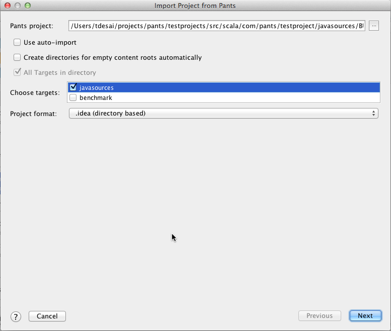

# intellij-pants-plugin

The intelliJ-pants-plugin supports importing, compiling and testing [pants](http://pantsbuild.github.io/) projects.
Current 1.0.0 version of plugin supports scala and java projects.

## User documentation

### Installing the Plugin
Please use “Plugins” tab: (Main menu: Settings | Plugins) to install the plugin.
Find "Pants Support" plugin. Install and Restart IntelliJ.

### Importing a Pants Project.
Using this plugin you can import entire project or specific targets in a BUILD file.

* Importing an entire project directory
    1. Use Main menu: File -> Import Project
    2. Select project directory
         
    3. Choose "Pants" on the next screen
    4. Make sure the check box "All Targets in the directory" is enabled and proceed with the wizard

* Importing targets from Build File
    1. Use Main menu: File -> Import Project
    2. Select a Build File from within the project
         
    3. Check the targets you want to Import and proceed with the wizard. (Please wait for the targets to show up)
          

Once you import the project using above steps, you will see the "Project View" with multiple modules configured.  
Each module represents BUILD target. You can now start navigating the through project files and editing files.  
The plugin will resolve the project dependencies using `pants goal resolve` in background and configure all the module dependency.
 Once the resolve is done, you can compile the entire project using Main menu: Build -> Compile.
 You can also compile individual modules by Right clicking on the module in "Project View" and Choose "Make Module" option.

### Plugin Features.
* Project File Tree View.
   The plugin configures modules per pants build target. Due to multiple modules, the default "Project View" is not very user friendly.
   The Plugin provides a custom view "Project Files Tree View". This view adheres to your repository file hierarchy.
   You can switch to this view as follows:
    
* Build File Auto completion
   The plugin provides auto completion for Build file targets. Cntrl+Space within BUILD file will list all pants targets.
* Project Regeneration using Intellij Action.
   If you add a dependency to your project, you can re-resolve project using Intellij Action in background.
   Use Main Menu: Help -> Find Action or Short hand Cmd+Shift+A and select Action "Refresh all External Projects"
   Remember to check "Include non-menu actions"
    
* Compiling within Intellij
* Running tests within Intellij
  You can right click on tests and run tests. There is known bug for running tests which access resources.

### Whats in near Future?
* Right click on `target` definition within BUILD file will navigate to pants target definition.
* Multiple project imports in the same window.
   Right now, importing/adding another target or project to an imported project is not supported.
* Automatic regeneration of project on changes in files used for code generation.
   Pants provides code generation for thrift, antrl and protobuf.
  Changing a thrift file or protobug file in source will run pants resolve in background.

### Report Bugs
If you see any bugs please file a github issue on the project page.
For contributing to the project, continue reading below.

## Contributing Guidelines:

* Checkout the code
   git clone https://github.com/pantsbuild/intellij-pants-plugin
* Create a new branch off master to make your changes
   git checkout -b $FEATURE_BRANCH
* Run tests to verify your installation
* Post your first review
   ./rbt post -o -g
* Iterating over the review
   ./rbt post -o -r <RB_ID>
* Commiting your change to master
   git checkout master
   git pull
   ./rbt patch -c <RB_ID>

### Intellij project setup:

* Download and open IntelliJ IDEA 13 Community Edition and install Python Community Edition plugin
* Use IntelliJ IDEA 13 Community Edition as IDEA IC sdk(Project Structure(Cmd + ;) -> SDK -> '+' button -> IntelliJ Platform Plugin SDK)
* Add all jars from ~/Library/Application Support/IdeaIC13/python/lib/ to the sdk's classpath
* Add ~/Library/Application Support/IdeaIC13/Scala/lib/scala-plugin.jar to the sdk's classpath
* A Scala facet is already configured but SCALA_LIB_HOME path variable should be configured in Preferences -> Path Variables
* Make sure that your project is set to configure bytecode compatible with 1.6  Preferences -> Compiler -> Java Compiler -> Project bytecode version
* Run tests to verify your installation

### Debugging the Plugin from local pants development:

* If you want to debug plugin using your local development pants, you can do so by using the property pants.executable.path.
  Add this configuration to Pants Run config.
  e.g.
  -Dpants.executable.path=/path/to/pants_dev/pants
* Remember to bootstrap pants in the project repository inside which you want to test the plugin.
  cd ~/workspace/example_project
  /path/to/pants_dev/pants goal goals

  This will bootstrap pants and resolve all the dependencies or else you will get an ExecutionException exception for exceeding 30s Timeout.
